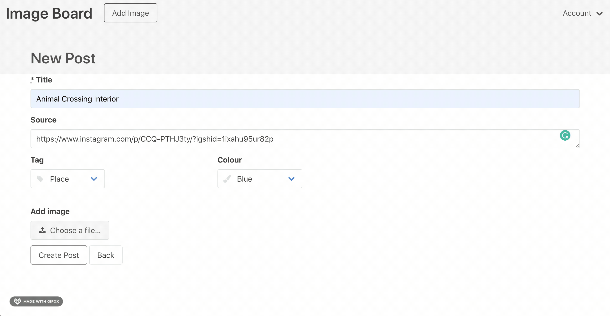

# Image Board

## Functioning Features
1. Secure uploading of images
- Have to be logged in in order to upload images
- Only able to view when not logged in 

2. Secure deletion of images
- Only submitter is able to edit or delete image

## To Do
1. Implement search feature
2. Improve stylesheets
